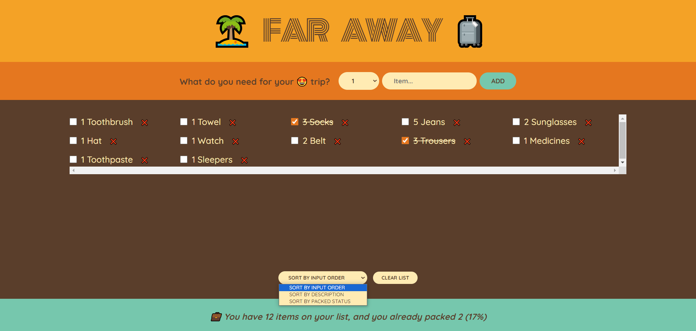

## # Trip Tick App 🧳🏝

This React application simplifies trip packing with a checklist. Users can add items, specify quantity and name, and manage the list with checkboxes and a deletion option. Sorting options include by order, description, and packed status. A "Clear All" feature requires user confirmation before erasing the list. Real-time statistics at the bottom track the total items, packed items, and the completion percentage.

## 🚀 Live Demo

[https://trip-tick-go.vercel.app/](https://trip-tick-go.vercel.app/)

## # Screenshot

## 💊 Learning goals

- Manage data using **useState**.
- Implement controlled elements.
- Calculate **statistics as derived state**.
- Practice thinking in React and **state management**.
- Implement **child-to-parent** communication.
- Master the concept of **lifting up state**.
- Practice displaying **items sorted** by different criteria.
- Utilize **React DevTools** for debugging and development analysis.
- Learn how to dynamically create and populate the options of a select input element using the **Array.from**.

##

I hope you enjoy this app as much as I enjoyed creating it.
So go ahead, start planning your next trip, and remember to pack light! 🌴 ✈️

